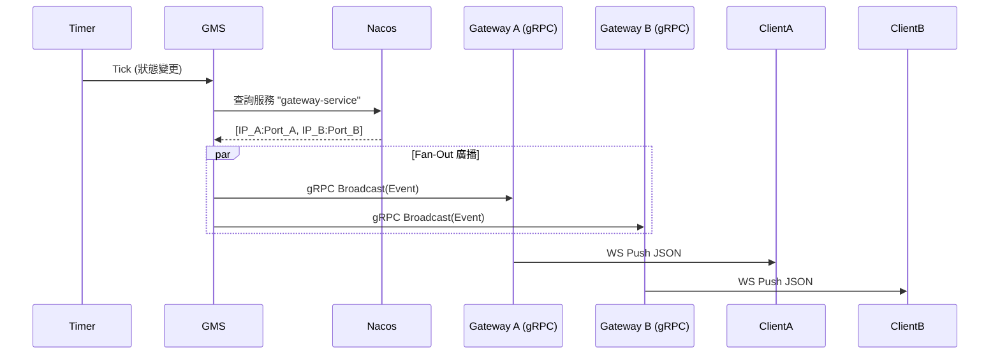

# Color Game - 微服務架構指南

本目錄說明 Color Game (猜色遊戲) 的微服務部署架構。此架構將關注點分離為獨立的服務，以實現可擴展性、可維護性和容錯能力。

## 🏗 系統組件 (System Components)

系統由以下微服務組成：

1.  **Gateway Service (網關服務) (`cmd/color_game/microservices/gateway`)**
    *   **角色**: 連接層與反向代理。
    *   **職責**:
        *   管理與客戶端的持久 WebSocket 連線。
        *   透過 gRPC 將客戶端請求 (如下注) 轉發至對應的後端服務 (GS)。
        *   透過 gRPC 接收來自 GMS 的廣播事件，並將其推送給所有已連線的 WebSocket 客戶端。
        *   *純代理 (Pure Proxy)*: **不包含**任何業務邏輯、狀態機或資料庫存取。
    *   **端口 (Ports)**:
        *   HTTP/WebSocket: `8081` (標準化固定端口)
        *   gRPC: 隨機端口 (註冊至 Nacos)

2.  **Game Management Service (GMS - 遊戲管理服務) (`cmd/color_game/microservices/gms`)**
    *   **角色**: 遊戲的"心臟"。
    *   **職責**:
        *   執行遊戲循環狀態機 (閒置 -> 下注 -> 開獎 -> 結果 -> 結算)。
        *   生成遊戲結果 (RNG - 隨機數生成)。
        *   透過 gRPC Fan-out (扇出) 將狀態變更 **廣播** 給 **所有** Gateway 實例。
        *   透過 gRPC 觸發 GS 進行結算。
    *   **端口 (Ports)**:
        *   gRPC: 隨機端口 (註冊至 Nacos，服務名: `gms-service`)

3.  **Game Service (GS - 遊戲邏輯服務) (`cmd/color_game/microservices/gs`)**
    *   **角色**: 業務邏輯與交易處理。
    *   **職責**:
        *   驗證並記錄下注 (Bet)。
        *   計算賠率並處理結算 (Settlement)。
        *   與 Wallet/User 服務交互 (扣款/派彩)。
    *   **端口 (Ports)**:
        *   gRPC: 隨機端口 (註冊至 Nacos，服務名: `gs-service`)

4.  **User Service (用戶服務 - Monolith/Shared)**
    *   **角色**: 用戶身份與錢包管理。
    *   **職責**: 註冊、登入、餘額查詢、餘額變更 (加扣款)。
    *   **端口 (Ports)**:
        *   HTTP API: `8082` (標準化固定端口)

---

## 📡 通信與事件廣播架構

**關鍵架構決策：不使用 Redis Pub/Sub**

我們嚴格使用 **gRPC** 進行所有服務間通信，以確保類型安全 (Protobuf) 和可追蹤性。

### 事件廣播流程 (狀態變更)

1.  **GMS** 狀態機發生轉換 (例如：進入 `BETTING` 下注階段)。
2.  **GMS** 使用 `BaseClient` 從 **Nacos** 查找 **所有** 健康的 `gateway-service` 實例。
3.  **GMS** 執行 **gRPC Fan-Out**，並行調用每個 Gateway 實例的 `Broadcast()` 方法。
4.  **Gateway** 收到 gRPC 調用。
5.  **Gateway** 將事件推送給該實例上所有已連線的 WebSocket 客戶端。



### 服務發現 (Service Discovery - Nacos)

*   **註冊中心**: Alibaba Nacos。
*   **客戶端封裝**: `pkg/grpc_client/base`。
*   **機制**:
    *   服務啟動時使用 **隨機端口** 註冊自己。
    *   客戶端查詢 Nacos 獲取服務地址列表。
    *   **TTL 快取 (TTL Caching)**: 客戶端快取服務地址 **10秒**。
    *   **自動失效**: 如果快取過期，客戶端將在下一次調用時從 Nacos 獲取最新列表。

---

## 🛠 配置與端口列表

| 服務 (Service) | 協議 | 端口 | 說明 |
| :--- | :--- | :--- | :--- |
| **Gateway** | HTTP/WS | **8081** | WebSocket 端點 (`/ws`) |
| **User API** | HTTP | **8082** | REST API (`/api/users/...`) |
| **GMS** | gRPC | 隨機 | 透過 Nacos 發現 (`gms-service`) |
| **GS** | gRPC | 隨機 | 透過 Nacos 發現 (`gs-service`) |
| **Gateway** | gRPC | 隨機 | 透過 Nacos 發現 (`gateway-service`) |
| **Nacos** | HTTP | 8848 | 服務註冊中心 |
| **Redis** | TCP | 6379 | 快取與數據 |
| **Postgres**| TCP | 5432 | 持久化存儲 |

---

## 🚀 如何運行 (How to Run)

### 前置條件
*   Docker (用於 Nacos, Redis, Postgres)
*   Go 1.21+

### 1. 啟動基礎設施
```bash
# 啟動 Nacos, Redis, Postgres
docker-compose up -d
```

### 2. 啟動微服務 (請使用不同的終端視窗)

**Terminal 1: Gateway (網關)**
```bash
go run ./cmd/color_game/microservices/gateway/main.go
```

**Terminal 2: GMS (遊戲管理)**
```bash
go run ./cmd/color_game/microservices/gms/main.go
```

**Terminal 3: GS (遊戲邏輯)**
```bash
go run ./cmd/color_game/microservices/gs/main.go
```

### 3. 啟動測試機器人 (Client)
```bash
# 連接 User API (8082) 進行登入，連接 Gateway (8081) 進行遊戲
go run ./cmd/color_game/test_robot/main.go -users 10
```

---


---

## 🛠 OPS 運維工具 (OPS Consoles)

我們提供了一個強大的 **OPS Web 控制台**，用於調試 gRPC 接口、監控服務狀態和測試廣播功能。

### 1. 啟動 OPS
```bash
go run ./cmd/ops/main.go
# 服務將啟動在 http://localhost:7090
```

### 2. 使用功能
打開瀏覽器訪問 `http://localhost:7090`，您可以：

#### A. 測試廣播 (TestBroadcast)
用於驗證 GMS -> Gateway -> WebSocket 的廣播鏈路是否暢通。
1. 在 RPC Console 選擇方法 `TestBroadcast`。
2. 輸入 JSON Payload：
   ```json
   {
     "game_code": "color_game",
     "round_id": "test_round_manual_01",
     "state": "BETTING"
   }
   ```
3. 點擊 **Execute RPC**。
4. **觀察結果**：
   - OPS 日誌應顯示 `Discovered gateway instances` 和 `Broadcast RPC succeeded`。
   - 所有已連線的 WebSocket 客戶端（如 test_robot）應收到推播消息。

#### B. 查詢遊戲狀態 (GetState)
直接查詢 GMS 的當前狀態。
1. 選擇方法 `GetState`。
2. 點擊 **Execute RPC**。
3. 返回結果將顯示當前的 `round_id` 和剩餘時間。

---

## ⚠️ 常見問題排查 (Common Pitfalls)

1.  **"Gateway 收不到廣播? (Gateway not receiving broadcasts)"**:
    *   檢查 Gateway 是否已成功註冊到 Nacos: `curl "http://localhost:8848/nacos/v1/ns/instance/list?serviceName=gateway-service"`
    *   檢查 GMS 日誌是否顯示 `Discovered gateway instances`。
    *   如果您剛重啟 Gateway，請等待 10秒 (TTL) 讓 GMS 更新快取。

2.  **"端口衝突 (Port Conflicts)"**:
    *   確保沒有舊的 `monolith` 進程佔用 8081/8082。
    *   使用 `lsof -i :8081` / `lsof -i :8082` 檢查。

3.  **"路由錯誤 (Wrong Routing)"**:
    *   **Gateway** 絕對 **不能** 包含 `GS` 的邏輯。它必須嚴格透過 gRPC 轉發。
    *   如果您在 Gateway 的 import 中看到 `colorgameGSLocal`，那就是 **錯誤的**。
