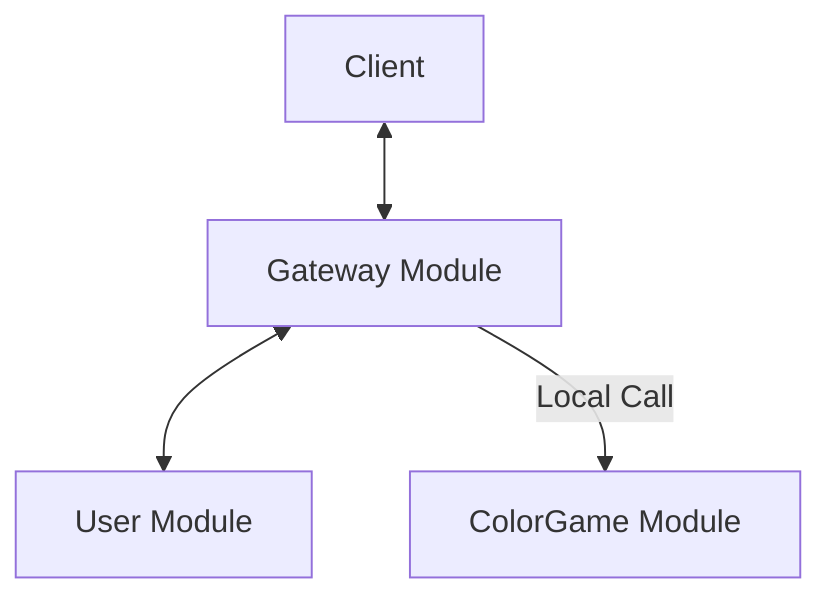

# Color Game Monolith Guide

本文檔詳細說明 Color Game **Monolith 模式** 的啟動方式以及運維指南。

## 1. 核心思維 (Core Philosophy)

### Modular Monolith First
在開發初期與中小型規模部署 (< 10k CCU) 時，我們使用 **Monolith 模式**。

*   **開發效率**: 單一進程，無需處理複雜的 RPC 網路問題與服務發現。
*   **效能優勢**: 模組間調用 (e.g., Gateway -> Game) 是內存函數調用，零延遲。
*   **部署簡單**: 只有一個 Binary，運維成本極低。

### Microservices Ready
雖然是單體，但我們嚴格遵守 Clean Architecture 與模組邊界。當業務規模擴大時，可以輕鬆將 `GMS` 或 `User` 服務拆分出去。

---

## 2. 啟動指南 (Startup Guide)

### 2.1 環境變量配置
確保配置以下環境變量（或使用默認值）：

```bash
# 數據庫配置
export COLORGAME_DB_HOST=localhost
export COLORGAME_DB_PORT=5432
export COLORGAME_DB_USER=postgres
export COLORGAME_DB_PASSWORD=postgres
export COLORGAME_DB_NAME=game_product

# Redis 配置 (用於 Session 與 廣播)
export REDIS_ADDR=localhost:6379
```

### 2.2 啟動服務

```bash
# 1. 確保數據庫和 Redis 已啟動
# 2. 啟動服務
go run cmd/color_game/monolith/main.go

# 服務將在 :8081 啟動
# WebSocket: ws://localhost:8081/ws?token=YOUR_TOKEN
# API: http://localhost:8081/api
```

### 2.3 API 使用流程

#### 步驟 1: 註冊用戶

```bash
curl -X POST http://localhost:8081/api/users/register \
  -H "Content-Type: application/json" \
  -d '{
    "username": "player1",
    "password": "password123",
    "email": "player1@example.com"
  }'
```

**回應範例**:
```json
{
  "user_id": 1001,
  "success": true
}
```

#### 步驟 2: 登入獲取 Token

```bash
curl -X POST http://localhost:8081/api/users/login \
  -H "Content-Type: application/json" \
  -d '{
    "username": "player1",
    "password": "password123"
  }'
```

**回應範例**:
```json
{
  "user_id": 1001,
  "token": "eyJhbGciOiJIUzI1NiIsInR5cCI6IkpXVCJ9..."
}
```

#### 步驟 3: 連接 WebSocket 與 遊戲互動

詳細的 WebSocket 協議格式、指令與狀態流程，請參閱專屬文檔：
[WebSocket 協議文檔](../../../module/gateway/README.md)

該文檔包含：
1.  **連接方式**: `ws://localhost:8081/ws?token=...`
2.  **狀態通知**: `ColorGameRoundStateBRC`
3.  **下注指令**: `ColorGamePlaceBetREQ`
4.  **結算通知**: `ColorGameSettlementBRC`
5.  **錯誤代碼表**

---

## 3. 架構與數據流

### Monolith 模式數據流

*   所有模組在同一個 Process 內。
*   Gateway 直接調用 ColorGame 的 UseCase。
*   ColorGame 直接通過 Go Channel 廣播事件給 Gateway。

---

## 4. 運維與監控

### 4.1 日誌 (Logging)
*   **格式**: 生產環境請使用 JSON 格式 (`logger.InitWithFile(..., "json")`)。
*   **關鍵日誌**:
    *   `Settlement completed successfully`: 結算成功。
    *   `Failed to deposit winnings`: 派彩失敗 (需人工介入)。

### 4.2 故障排查 (Troubleshooting)

**問題：玩家贏了但沒收到通知**
*   檢查日誌中是否有 `Failed to deposit winnings`。
*   如果錢包操作失敗，系統會有意不發送通知以避免誤導。
*   檢查 `bet_orders` 表確認結算記錄是否已寫入。

**問題：Connection Reset by Peer**
*   檢查是否開啟了 `Debug` 日誌且輸出到 Console (請改用 Info + JSON)。
*   檢查 `ulimit -n` 是否足夠大。

---

## 5. 最新功能更新 (2025-12)

### 數據庫重構
*   Repository 包名從 `postgres` 重構為 `db`。
*   引入 `BetOrderRepository` 用於結算記錄持久化。

### 結算流程優化
1.  **分批處理**: 每 500 筆下注為一個批次。
2.  **DB 寫入優先**: 確保數據持久化後才進行錢包操作。
3.  **條件通知**: 只有錢包派彩成功後才會發送贏家通知。

### 下注累加機制
*   同一個玩家在同一局中，對同一個區域（如 "red"）只能有一筆下注記錄。
*   重複下注會自動累加金額，保持 `BetID` 不變。

---

## 6. 遊戲狀態機流程 (Game State Machine)

### 6.1 狀態轉換流程

遊戲狀態機會自動循環執行以下階段：

```
GAME_STATE_ROUND_STARTED → GAME_STATE_BETTING → GAME_STATE_DRAWING → GAME_STATE_RESULT → GAME_STATE_ROUND_ENDED → (下一回合)
```

### 6.2 設計模式：觀察者模式 (Observer Pattern)

狀態機使用 **Observer Pattern** 來解耦核心邏輯與外部通知。

*   **機制**: `StateMachine` 維護一個 `EventHandler` 列表。
*   **註冊**: 外部模組 (如 `GMSUseCase`) 通過 `RegisterEventHandler` 註冊回調函數。
*   **通知 (`emitEvent`)**:
    *   當狀態發生變化時，`emitEvent` 會被調用。
    *   **非阻塞設計**: 系統會為每個註冊的 handler 啟動一個 **Goroutine** (`go handler(event)`) 進行異步通知。
    *   這確保了狀態機的計時循環不會因為外部處理（如寫入 DB 或網絡廣播）的延遲而被阻塞。

### 6.3 實現與併發模型 (Concurrency Model)

狀態機在 `runRound` 中使用 `time.Sleep` 來控制階段時長。這在 Go 語言中是 **高效且安全** 的設計：

*   **非阻塞 OS 線程**: Go 的 `time.Sleep` 僅會掛起當前 Goroutine (`G`)，並讓出底層 OS 線程 (`M`) 去執行其他任務（如下注請求）。
*   **Timer 機制**: Go Runtime 使用全局堆 (Heap) 管理 Timer，時間到後自動喚醒 Goroutine，開銷極低。
*   **Graceful Shutdown**: 當調用 `Stop()` 時，狀態機會等待當前階段 (`Sleep`) 結束後才檢查停止標誌，這確保了**回合的完整性**，不會在下注一半時突然中斷。

### 6.4 各階段時長配置

預設配置（可在 `StateMachine` 初始化時調整）：

| 階段 | 狀態 | 持續時間 | 說明 |
|------|------|----------|------|
| 1. 回合開始 | `GAME_STATE_ROUND_STARTED` | **2 秒** | 生成新的回合 ID，等待玩家準備 |
| 2. 下注階段 | `GAME_STATE_BETTING` | **10 秒** | 玩家可以下注，倒數計時顯示剩餘時間 |
| 3. 開獎階段 | `GAME_STATE_DRAWING` | **2 秒** | 停止下注，系統抽取結果 |
| 4. 結果公布 | `GAME_STATE_RESULT` | **5 秒** | 顯示開獎結果，觸發結算流程 |
| 5. 回合結束 | `GAME_STATE_ROUND_ENDED` | **3 秒** | 休息時間，準備下一回合 |

**總回合時長**: 約 **22 秒** (2 + 10 + 2 + 5 + 3)

### 6.5 狀態事件詳細說明

#### 1. GAME_STATE_ROUND_STARTED
```json
{
    "command": "ColorGameRoundStateBRC",
    "data": {
        "round_id": "20251205123456",
        "state": "GAME_STATE_ROUND_STARTED",
        "left_time": 2,  // 等待 2 秒後開始下注
        "betting_end_timestamp": 0
    },
    "game_code": "color_game"
}
```
- **left_time**: 表示距離下注開始還有 2 秒
- **用途**: 前端可以顯示「準備中，2 秒後開始下注」

#### 2. GAME_STATE_BETTING
```json
{
    "command": "ColorGameRoundStateBRC",
    "data": {
        "round_id": "20251205123456",
        "state": "GAME_STATE_BETTING",
        "left_time": 10,  // 距離下注結束還有幾秒
        "betting_end_timestamp": 1733377991  // 下注結束的 Unix 時間戳
    },
    "game_code": "color_game"
}
```
- **left_time**: 下注階段剩餘時間
- **betting_end_timestamp**: 下注結束的絕對時間
- **用途**: 前端顯示倒數計時，玩家可以下注

#### 3. GAME_STATE_DRAWING
```json
{
    "command": "ColorGameRoundStateBRC",
    "data": {
        "round_id": "20251205123456",
        "state": "GAME_STATE_DRAWING",
        "left_time": 2,  // 開獎階段持續 2 秒
        "betting_end_timestamp": 1733377991
    },
    "game_code": "color_game"
}
```
- **用途**: 停止接受下注，顯示開獎動畫

#### 4. GAME_STATE_RESULT
```json
{
    "command": "ColorGameRoundStateBRC",
    "data": {
        "round_id": "20251205123456",
        "state": "GAME_STATE_RESULT",
        "left_time": 5,  // 結果顯示持續 5 秒
        "betting_end_timestamp": 1733377991
    },
    "game_code": "color_game"
}
```
- **用途**: 顯示開獎結果，觸發玩家結算（結算結果通過 `ColorGameSettlementBRC` 發送）

#### 5. GAME_STATE_ROUND_ENDED
```json
{
    "command": "ColorGameRoundStateBRC",
    "data": {
        "round_id": "20251205123456",
        "state": "GAME_STATE_ROUND_ENDED",
        "left_time": 3,  // 休息時間 3 秒
        "betting_end_timestamp": 1733377991
    },
    "game_code": "color_game"
}
```
- **用途**: 回合結束，準備下一回合

### 6.6 自定義時長配置

如需調整各階段時長，可在啟動時修改：

```go
stateMachine := gmsMachine.NewStateMachine()
stateMachine.WaitDuration = 3 * time.Second      // 回合開始等待 3 秒
stateMachine.BettingDuration = 30 * time.Second  // 下注 30 秒
stateMachine.DrawingDuration = 3 * time.Second   // 開獎 3 秒
stateMachine.ResultDuration = 10 * time.Second   // 結果顯示 10 秒
stateMachine.RestDuration = 5 * time.Second      // 休息 5 秒
```
*   Gateway 直接調用 ColorGame 的 UseCase。
*   ColorGame 直接通過 Go Channel 廣播事件給 Gateway。

### Microservices 模式數據流
```
Client <-> [Gateway Service] <-> [User Service]
                  ^
                  | (gRPC)
                  v
           [GMS Service]
```
*   Gateway 通過 gRPC Client 調用 GMS。
*   GMS 通過 gRPC Stream 推送事件給 Gateway。

---

## 5. 運維與監控

### 5.1 日誌 (Logging)
*   **格式**: 生產環境請使用 JSON 格式 (`logger.InitWithFile(..., "json")`)。
*   **關鍵日誌**:
    *   `Settlement completed successfully`: 結算成功。
    *   `Failed to deposit winnings`: 派彩失敗 (需人工介入)。

### 5.2 故障排查 (Troubleshooting)

**問題：玩家贏了但沒收到通知**
*   檢查日誌中是否有 `Failed to deposit winnings`。
*   如果錢包操作失敗，系統會有意不發送通知以避免誤導。
*   檢查 `bet_orders` 表確認結算記錄是否已寫入。

**問題：Connection Reset by Peer**
*   檢查是否開啟了 `Debug` 日誌且輸出到 Console (請改用 Info + JSON)。
*   檢查 `ulimit -n` 是否足夠大。

---

## 6. 最新功能更新 (2025-12)

### 數據庫重構
*   Repository 包名從 `postgres` 重構為 `db`。
*   引入 `BetOrderRepository` 用於結算記錄持久化。

### 結算流程優化
1.  **分批處理**: 每 500 筆下注為一個批次。
2.  **DB 寫入優先**: 確保數據持久化後才進行錢包操作。
3.  **條件通知**: 只有錢包派彩成功後才會發送贏家通知。

### 下注累加機制
*   同一個玩家在同一局中，對同一個區域（如 "red"）只能有一筆下注記錄。
*   重複下注會自動累加金額，保持 `BetID` 不變。

---

## 7. 遊戲狀態機流程 (Game State Machine)

### 7.1 狀態轉換流程

遊戲狀態機會自動循環執行以下階段：

```
GAME_STATE_ROUND_STARTED → GAME_STATE_BETTING → GAME_STATE_DRAWING → GAME_STATE_RESULT → GAME_STATE_ROUND_ENDED → (下一回合)
```

### 7.2 設計模式：觀察者模式 (Observer Pattern)

狀態機使用 **Observer Pattern** 來解耦核心邏輯與外部通知。

*   **機制**: `StateMachine` 維護一個 `EventHandler` 列表。
*   **註冊**: 外部模組 (如 `GMSUseCase`) 通過 `RegisterEventHandler` 註冊回調函數。
*   **通知 (`emitEvent`)**:
    *   當狀態發生變化時，`emitEvent` 會被調用。
    *   **非阻塞設計**: 系統會為每個註冊的 handler 啟動一個 **Goroutine** (`go handler(event)`) 進行異步通知。
    *   這確保了狀態機的計時循環不會因為外部處理（如寫入 DB 或網絡廣播）的延遲而被阻塞。

### 7.3 實現與併發模型 (Concurrency Model)

狀態機在 `runRound` 中使用 `time.Sleep` 來控制階段時長。這在 Go 語言中是 **高效且安全** 的設計：

*   **非阻塞 OS 線程**: Go 的 `time.Sleep` 僅會掛起當前 Goroutine (`G`)，並讓出底層 OS 線程 (`M`) 去執行其他任務（如下注請求）。
*   **Timer 機制**: Go Runtime 使用全局堆 (Heap) 管理 Timer，時間到後自動喚醒 Goroutine，開銷極低。
*   **Graceful Shutdown**: 當調用 `Stop()` 時，狀態機會等待當前階段 (`Sleep`) 結束後才檢查停止標誌，這確保了**回合的完整性**，不會在下注一半時突然中斷。

### 7.4 各階段時長配置

預設配置（可在 `StateMachine` 初始化時調整）：

| 階段 | 狀態 | 持續時間 | 說明 |
|------|------|----------|------|
| 1. 回合開始 | `GAME_STATE_ROUND_STARTED` | **2 秒** | 生成新的回合 ID，等待玩家準備 |
| 2. 下注階段 | `GAME_STATE_BETTING` | **10 秒** | 玩家可以下注，倒數計時顯示剩餘時間 |
| 3. 開獎階段 | `GAME_STATE_DRAWING` | **2 秒** | 停止下注，系統抽取結果 |
| 4. 結果公布 | `GAME_STATE_RESULT` | **5 秒** | 顯示開獎結果，觸發結算流程 |
| 5. 回合結束 | `GAME_STATE_ROUND_ENDED` | **3 秒** | 休息時間，準備下一回合 |

**總回合時長**: 約 **22 秒** (2 + 10 + 2 + 5 + 3)

### 7.5 狀態事件詳細說明

#### 1. GAME_STATE_ROUND_STARTED
```json
{
    "command": "ColorGameRoundStateBRC",
    "data": {
        "round_id": "20251205123456",
        "state": "GAME_STATE_ROUND_STARTED",
        "left_time": 2,  // 等待 2 秒後開始下注
        "betting_end_timestamp": 0
    },
    "game_code": "color_game"
}
```
- **left_time**: 表示距離下注開始還有 2 秒
- **用途**: 前端可以顯示「準備中，2 秒後開始下注」

#### 2. GAME_STATE_BETTING
```json
{
    "command": "ColorGameRoundStateBRC",
    "data": {
        "round_id": "20251205123456",
        "state": "GAME_STATE_BETTING",
        "left_time": 10,  // 距離下注結束還有幾秒
        "betting_end_timestamp": 1733377991  // 下注結束的 Unix 時間戳
    },
    "game_code": "color_game"
}
```
- **left_time**: 下注階段剩餘時間
- **betting_end_timestamp**: 下注結束的絕對時間
- **用途**: 前端顯示倒數計時，玩家可以下注

#### 3. GAME_STATE_DRAWING
```json
{
    "command": "ColorGameRoundStateBRC",
    "data": {
        "round_id": "20251205123456",
        "state": "GAME_STATE_DRAWING",
        "left_time": 2,  // 開獎階段持續 2 秒
        "betting_end_timestamp": 1733377991
    },
    "game_code": "color_game"
}
```
- **用途**: 停止接受下注，顯示開獎動畫

#### 4. GAME_STATE_RESULT
```json
{
    "command": "ColorGameRoundStateBRC",
    "data": {
        "round_id": "20251205123456",
        "state": "GAME_STATE_RESULT",
        "left_time": 5,  // 結果顯示持續 5 秒
        "betting_end_timestamp": 1733377991
    },
    "game_code": "color_game"
}
```
- **用途**: 顯示開獎結果，觸發玩家結算（結算結果通過 `ColorGameSettlementBRC` 發送）

#### 5. GAME_STATE_ROUND_ENDED
```json
{
    "command": "ColorGameRoundStateBRC",
    "data": {
        "round_id": "20251205123456",
        "state": "GAME_STATE_ROUND_ENDED",
        "left_time": 3,  // 休息時間 3 秒
        "betting_end_timestamp": 1733377991
    },
    "game_code": "color_game"
}
```
- **用途**: 回合結束，準備下一回合

### 7.4 自定義時長配置

如需調整各階段時長，可在啟動時修改：

```go
```
# Color Game Monolith Guide

本文檔詳細說明 Color Game **Monolith 模式** 的啟動方式以及運維指南。

## 1. 核心思維 (Core Philosophy)

### Modular Monolith First
在開發初期與中小型規模部署 (< 10k CCU) 時，我們使用 **Monolith 模式**。

*   **開發效率**: 單一進程，無需處理複雜的 RPC 網路問題與服務發現。
*   **效能優勢**: 模組間調用 (e.g., Gateway -> Game) 是內存函數調用，零延遲。
*   **部署簡單**: 只有一個 Binary，運維成本極低。

### Microservices Ready
雖然是單體，但我們嚴格遵守 Clean Architecture 與模組邊界。當業務規模擴大時，可以輕鬆將 `GMS` 或 `User` 服務拆分出去。

---

## 2. 啟動指南 (Startup Guide)

### 2.1 環境變量配置
確保配置以下環境變量（或使用默認值）：

```bash
# 數據庫配置
export COLORGAME_DB_HOST=localhost
export COLORGAME_DB_PORT=5432
export COLORGAME_DB_USER=postgres
export COLORGAME_DB_PASSWORD=postgres
export COLORGAME_DB_NAME=game_product

# Redis 配置 (用於 Session 與 廣播)
export REDIS_ADDR=localhost:6379
```

### 2.2 啟動服務

```bash
# 1. 確保數據庫和 Redis 已啟動
# 2. 啟動服務
go run cmd/color_game/monolith/main.go

# 服務將在 :8081 啟動
# WebSocket: ws://localhost:8081/ws?token=YOUR_TOKEN
# API: http://localhost:8081/api
```

### 2.3 API 使用流程

#### 步驟 1: 註冊用戶

```bash
curl -X POST http://localhost:8081/api/users/register \
  -H "Content-Type: application/json" \
  -d '{
    "username": "player1",
    "password": "password123",
    "email": "player1@example.com"
  }'
```

**回應範例**:
```json
{
  "user_id": 1001,
  "success": true
}
```

#### 步驟 2: 登入獲取 Token

```bash
curl -X POST http://localhost:8081/api/users/login \
  -H "Content-Type: application/json" \
  -d '{
    "username": "player1",
    "password": "password123"
  }'
```

**回應範例**:
```json
{
  "user_id": 1001,
  "token": "eyJhbGciOiJIUzI1NiIsInR5cCI6IkpXVCJ9..."
}
```

#### 步驟 3: 連接 WebSocket 與 遊戲互動

詳細的 WebSocket 協議格式、指令與狀態流程，請參閱專屬文檔：
[WebSocket 協議文檔](../../../module/gateway/README.md)

該文檔包含：
1.  **連接方式**: `ws://localhost:8081/ws?token=...`
2.  **狀態通知**: `ColorGameRoundStateBRC`
3.  **下注指令**: `ColorGamePlaceBetREQ`
4.  **結算通知**: `ColorGameSettlementBRC`
5.  **錯誤代碼表**

Client <-> [Gateway Module] <-> [User Module]
                  ^
                  | (Local Call)
                  v
           [ColorGame Module]
```
*   所有模組在同一個 Process 內。
*   Gateway 直接調用 ColorGame 的 UseCase。
*   ColorGame 直接通過 Go Channel 廣播事件給 Gateway。

### Microservices 模式數據流
```
Client <-> [Gateway Service] <-> [User Service]
                  ^
                  | (gRPC)
                  v
           [GMS Service]
```
*   Gateway 通過 gRPC Client 調用 GMS。
*   GMS 通過 gRPC Stream 推送事件給 Gateway。

---

## 5. 運維與監控

### 5.1 日誌 (Logging)
*   **格式**: 生產環境請使用 JSON 格式 (`logger.InitWithFile(..., "json")`)。
*   **關鍵日誌**:
    *   `Settlement completed successfully`: 結算成功。
    *   `Failed to deposit winnings`: 派彩失敗 (需人工介入)。

### 5.2 故障排查 (Troubleshooting)

**問題：玩家贏了但沒收到通知**
*   檢查日誌中是否有 `Failed to deposit winnings`。
*   如果錢包操作失敗，系統會有意不發送通知以避免誤導。
*   檢查 `bet_orders` 表確認結算記錄是否已寫入。

**問題：Connection Reset by Peer**
*   檢查是否開啟了 `Debug` 日誌且輸出到 Console (請改用 Info + JSON)。
*   檢查 `ulimit -n` 是否足夠大。

---

## 6. 最新功能更新 (2025-12)

### 數據庫重構
*   Repository 包名從 `postgres` 重構為 `db`。
*   引入 `BetOrderRepository` 用於結算記錄持久化。

### 結算流程優化
1.  **分批處理**: 每 500 筆下注為一個批次。
2.  **DB 寫入優先**: 確保數據持久化後才進行錢包操作。
3.  **條件通知**: 只有錢包派彩成功後才會發送贏家通知。

### 下注累加機制
*   同一個玩家在同一局中，對同一個區域（如 "red"）只能有一筆下注記錄。
*   重複下注會自動累加金額，保持 `BetID` 不變。

---

## 7. 遊戲狀態機流程 (Game State Machine)

### 7.1 狀態轉換流程

遊戲狀態機會自動循環執行以下階段：

```
GAME_STATE_ROUND_STARTED → GAME_STATE_BETTING → GAME_STATE_DRAWING → GAME_STATE_RESULT → GAME_STATE_ROUND_ENDED → (下一回合)
```

### 7.2 設計模式：觀察者模式 (Observer Pattern)

狀態機使用 **Observer Pattern** 來解耦核心邏輯與外部通知。

*   **機制**: `StateMachine` 維護一個 `EventHandler` 列表。
*   **註冊**: 外部模組 (如 `GMSUseCase`) 通過 `RegisterEventHandler` 註冊回調函數。
*   **通知 (`emitEvent`)**:
    *   當狀態發生變化時，`emitEvent` 會被調用。
    *   **非阻塞設計**: 系統會為每個註冊的 handler 啟動一個 **Goroutine** (`go handler(event)`) 進行異步通知。
    *   這確保了狀態機的計時循環不會因為外部處理（如寫入 DB 或網絡廣播）的延遲而被阻塞。

### 7.3 各階段時長配置

預設配置（可在 `StateMachine` 初始化時調整）：

| 階段 | 狀態 | 持續時間 | 說明 |
|------|------|----------|------|
| 1. 回合開始 | `GAME_STATE_ROUND_STARTED` | **2 秒** | 生成新的回合 ID，等待玩家準備 |
| 2. 下注階段 | `GAME_STATE_BETTING` | **10 秒** | 玩家可以下注，倒數計時顯示剩餘時間 |
| 3. 開獎階段 | `GAME_STATE_DRAWING` | **2 秒** | 停止下注，系統抽取結果 |
| 4. 結果公布 | `GAME_STATE_RESULT` | **5 秒** | 顯示開獎結果，觸發結算流程 |
| 5. 回合結束 | `GAME_STATE_ROUND_ENDED` | **3 秒** | 休息時間，準備下一回合 |

**總回合時長**: 約 **22 秒** (2 + 10 + 2 + 5 + 3)

### 7.4 狀態事件詳細說明

#### 1. GAME_STATE_ROUND_STARTED
```json
{
    "command": "ColorGameRoundStateBRC",
    "data": {
        "round_id": "20251205123456",
        "state": "GAME_STATE_ROUND_STARTED",
        "left_time": 2,  // 等待 2 秒後開始下注
        "betting_end_timestamp": 0
    },
    "game_code": "color_game"
}
```
- **left_time**: 表示距離下注開始還有 2 秒
- **用途**: 前端可以顯示「準備中，2 秒後開始下注」

#### 2. GAME_STATE_BETTING
```json
{
    "command": "ColorGameRoundStateBRC",
    "data": {
        "round_id": "20251205123456",
        "state": "GAME_STATE_BETTING",
        "left_time": 10,  // 距離下注結束還有幾秒
        "betting_end_timestamp": 1733377991  // 下注結束的 Unix 時間戳
    },
    "game_code": "color_game"
}
```
- **left_time**: 下注階段剩餘時間
- **betting_end_timestamp**: 下注結束的絕對時間
- **用途**: 前端顯示倒數計時，玩家可以下注

#### 3. GAME_STATE_DRAWING
```json
{
    "command": "ColorGameRoundStateBRC",
    "data": {
        "round_id": "20251205123456",
        "state": "GAME_STATE_DRAWING",
        "left_time": 2,  // 開獎階段持續 2 秒
        "betting_end_timestamp": 1733377991
    },
    "game_code": "color_game"
}
```
- **用途**: 停止接受下注，顯示開獎動畫

#### 4. GAME_STATE_RESULT
```json
{
    "command": "ColorGameRoundStateBRC",
    "data": {
        "round_id": "20251205123456",
        "state": "GAME_STATE_RESULT",
        "left_time": 5,  // 結果顯示持續 5 秒
        "betting_end_timestamp": 1733377991
    },
    "game_code": "color_game"
}
```
- **用途**: 顯示開獎結果，觸發玩家結算（結算結果通過 `ColorGameSettlementBRC` 發送）

#### 5. GAME_STATE_ROUND_ENDED
```json
{
    "command": "ColorGameRoundStateBRC",
    "data": {
        "round_id": "20251205123456",
        "state": "GAME_STATE_ROUND_ENDED",
        "left_time": 3,  // 休息時間 3 秒
        "betting_end_timestamp": 1733377991
    },
    "game_code": "color_game"
}
```
- **用途**: 回合結束，準備下一回合

### 7.6 自定義時長配置

如需調整各階段時長，可在啟動時修改：

```go
stateMachine := gmsMachine.NewStateMachine()
stateMachine.WaitDuration = 3 * time.Second      // 回合開始等待 3 秒
stateMachine.BettingDuration = 30 * time.Second  // 下注 30 秒
stateMachine.DrawingDuration = 3 * time.Second   // 開獎 3 秒
stateMachine.ResultDuration = 10 * time.Second   // 結果顯示 10 秒
stateMachine.RestDuration = 5 * time.Second      // 休息 5 秒
```
