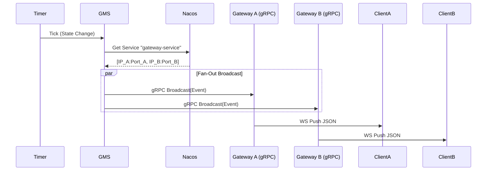

# Color Game - Microservices Architecture

This directory outlines the microservices deployment of the Color Game. This architecture separates concerns into distinct services for scalability, maintainability, and fault tolerance.

## 🏗 System Components

The system consists of the following microservices:

1.  **Gateway Service (`cmd/color_game/microservices/gateway`)**
    *   **Role**: Connectivity Layer & Reverse Proxy.
    *   **Responsibilities**:
        *   Manages persistent WebSocket connections with clients.
        *   Forwards client requests (Bet, etc.) to the appropriate backend service (GS) via gRPC.
        *   Receives broadcast events from GMS via gRPC and pushes them down to connected WebSocket clients.
        *   *Pure Proxy*: Contains **NO** business logic, state machine, or database access.
    *   **Ports**:
        *   HTTP/WebSocket: `8081` (Standardized)
        *   gRPC: Random (Registered to Nacos)

2.  **Game Management Service (GMS) (`cmd/color_game/microservices/gms`)**
    *   **Role**: The "Heart" of the game.
    *   **Responsibilities**:
        *   Runs the Game Loop State Machine (Idle -> Betting -> Drawing -> Result -> Settlement).
        *   Generates game results (RNG).
        *   **Broadcasts** state changes to **ALL** Gateway instances via gRPC fan-out.
        *   Triggers Settlement in GS via gRPC.
    *   **Ports**:
        *   gRPC: Random (Registered to Nacos as `gms-service`)

3.  **Game Service (GS) (`cmd/color_game/microservices/gs`)**
    *   **Role**: Business Logic & Transaction Handler.
    *   **Responsibilities**:
        *   Validates and records bets.
        *   Calculates payouts and processes settlement.
        *   Interacts with the Wallet/User service.
    *   **Ports**:
        *   gRPC: Random (Registered to Nacos as `gs-service`)

4.  **User Service (Monolith/Shared)**
    *   **Role**: User Identity & Wallet.
    *   **Responsibilities**: Registration, Login, Balance Query, Balance Updates.
    *   **Ports**:
        *   HTTP API: `8082` (Standardized)

---

## 📡 Communication & Event Broadcasting

**CRITICAL ARCHITECTURAL DECISION: NO REDIS PUB/SUB**

We strictly use **gRPC** for all inter-service communication to ensure type safety (Protobuf) and traceability.

### Event Broadcast Flow (State Change)

1.  **GMS** state machine transitions (e.g., to `BETTING`).
2.  **GMS** uses `BaseClient` to look up **ALL** healthy instances of `gateway-service` from **Nacos**.
3.  **GMS** performs a **gRPC Fan-Out**, calling `Broadcast()` on every Gateway instance.
4.  **Gateway** receives the gRPC call.
5.  **Gateway** pushes the event to all its connected WebSocket clients.



### Service Discovery (Nacos)

*   **Registry**: Alibaba Nacos.
*   **Client**: `pkg/grpc_client/base`.
*   **Mechanism**:
    *   Services register themselves on startup with a **Random Port**.
    *   Clients query Nacos to find service addresses.
    *   **TTL Caching**: Clients cache service addresses for **10 seconds**.
    *   **Invalidation**: If the cache expires, the client fetches the latest list from Nacos on the next call.

---

## 🛠 Configuration & Ports

| Service | Protocol | Port | Description |
| :--- | :--- | :--- | :--- |
| **Gateway** | HTTP/WS | **8081** | WebSocket Endpoint (`/ws`) |
| **User API** | HTTP | **8082** | REST API (`/api/users/...`) |
| **GMS** | gRPC | Random | Discovery via Nacos (`gms-service`) |
| **GS** | gRPC | Random | Discovery via Nacos (`gs-service`) |
| **Gateway** | gRPC | Random | Discovery via Nacos (`gateway-service`) |
| **Nacos** | HTTP | 8848 | Service Registry |
| **Redis** | TCP | 6379 | Caching |
| **Postgres**| TCP | 5432 | Persistence |

---

## 🚀 How to Run

### Prerequisites
*   Docker (for Nacos, Redis, Postgres)
*   Go 1.21+

### 1. Start Infrastructure
```bash
# Start Nacos, Redis, Postgres
docker-compose up -d
```

### 2. Start Services (Separate Terminals)

**Terminal 1: Gateway**
```bash
go run ./cmd/color_game/microservices/gateway/main.go
```

**Terminal 2: GMS**
```bash
go run ./cmd/color_game/microservices/gms/main.go
```

**Terminal 3: GS**
```bash
go run ./cmd/color_game/microservices/gs/main.go
```

### 3. Start Test Robot (Client)
```bash
# Connects to User API (8082) for login and Gateway (8081) for game
go run ./cmd/color_game/test_robot/main.go -users 10
```

---

## ⚠️ Common Pitfalls

1.  **"Gateway not receiving broadcasts"**:
    *   Check if Gateway is registered in Nacos: `curl "http://localhost:8848/nacos/v1/ns/instance/list?serviceName=gateway-service"`
    *   Check GMS logs for `Discovered gateway instances`.
    *   Wait 10s (TTL) if you just restarted Gateway.

2.  **"Port Conflicts"**:
    *   Ensure no old `monolith` process is running on 8081/8082.
    *   `lsof -i :8081` / `lsof -i :8082`

3.  **"Wrong Routing"**:
    *   The `Gateway` must **NOT** contain `GS` logic. It must strictly forward via gRPC.
    *   If you see `colorgameGSLocal` in Gateway imports, it is WRONG.
