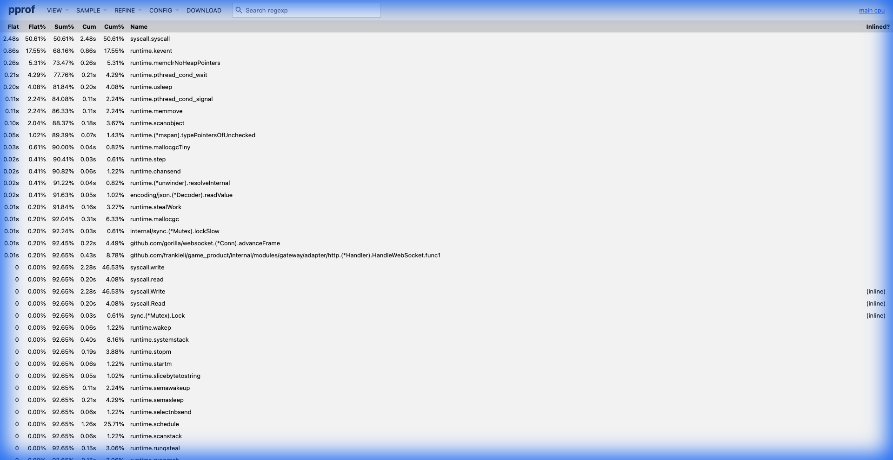
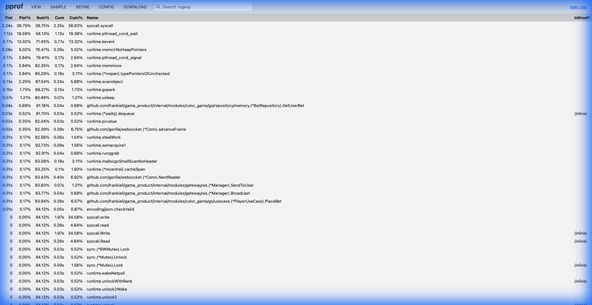

# Color Game Performance Benchmark & Optimization Report

本文件記錄了 Color Game 系統在高併發壓測下的效能表現、遇到的瓶頸、優化歷程以及最終結果。

## 1. 測試目標 (Objectives)

*   **目標用戶數**: 10,000+ 同時在線用戶 (CCU)。
*   **場景**: 用戶登入、保持 WebSocket 連接、接收廣播、進行下注。
*   **穩定性**: 在高負載下無 Connection Reset 或 Timeout。

## 2. 測試環境 (Environment)

*   **Server**: Color Game Monolith (Go)
*   **Client**: Test Robot (Go, 模擬真實 WebSocket 行為)
*   **Hardware**: Local Development Machine (MacBook Pro)
*   **Tools**: `go pprof`, `top`, `netstat`

---

## 3. 優化歷程 (Optimization Journey)

### Phase 1: 登入 CPU 瓶頸 (Login CPU Spike)
*   **現象**: 當大量機器人同時啟動時，Server CPU 瞬間飆升至 100%，導致後續連接超時。
*   **原因**: `bcrypt` 密碼驗證是非常消耗 CPU 的操作。當數千個登入請求同時到達，CPU 被耗盡。
*   **解決方案**:
    *   **客戶端優化**: 調整 Test Robot 的啟動策略，引入隨機延遲 (Jitter) 和分批啟動 (Ramp-up)，避免「驚群效應」(Thundering Herd)。
    *   **服務端建議**: 在生產環境中，應將 User 服務獨立，並使用 Redis 快取 Session，減少對 DB 和 bcrypt 的依賴。

### Phase 2: 連接數瓶頸 (Connection Limits)
*   **現象**: 用戶數達到 ~4000 時，出現 `socket: too many open files` 或 `connection reset by peer`。
*   **原因**:
    *   **File Descriptors**: OS 預設的 `ulimit -n` 通常只有 256 或 1024。
    *   **Ephemeral Ports**: 短時間內建立大量連接耗盡了客戶端的臨時端口。
*   **解決方案**:
    *   提升 `ulimit -n` 至 65535。
    *   調整 TCP 參數 (如 `tcp_tw_reuse`)。

### Phase 3: 日誌 I/O 瓶頸 (Logging Bottleneck)
*   **現象**: 在 4500 用戶時，Server 出現大量的 `Connection Reset`，且 WebSocket 心跳超時。
*   **原因**:
    *   Server 開啟了 `Debug` 級別日誌，且使用 `Console` 格式輸出到終端機。
    *   終端機的 I/O 是同步且阻塞的。當每秒有數萬條日誌要輸出時，主 Goroutine 被 I/O 阻塞，導致無法及時處理 WebSocket 的 Ping/Pong 和讀寫。
*   **解決方案**:
    *   **引入 SmartWriter**: 實作了基於記憶體緩衝的非同步寫入器。
    *   **優化配置**: 生產環境強制使用 `Info` 級別和 `JSON` 格式。
    *   **結果**: 消除 I/O 阻塞，成功突破 10k 用戶。

---

## 4. 問題排查指南 (Troubleshooting Guide)

### Error: `read tcp: connection reset by peer`
*   **原因 1 (最常見)**: **Server 端 I/O 阻塞 (I/O Blocking)**。
    *   當 Server 開啟 Debug 日誌且輸出到 Console 時，主 Goroutine 被同步的 `write` syscall 阻塞。
    *   這導致 Goroutine 無法及時執行 `conn.Read()` 來清空 OS 的 TCP Receive Buffer。
    *   當 TCP Buffer 滿了，OS 會拒絕客戶端發送的新封包，並最終發送 `RST` (Reset) 封包斷開連接。
    *   **特徵**: Server CPU 可能不高，但客戶端大量斷線，且 Server 日誌停滯。
    *   **診斷**: 觀察 Gateway 的 `CloseWithReason` 日誌，如果大量出現 `read_error` (connection reset) 或 `timeout`，且同時 Server Console 輸出變慢，極大機率是 I/O 阻塞。
*   **原因 2**: **CPU 阻塞 (Log Formatting Overhead)**。
    *   即使使用了 Async Writer，如果日誌格式設為 `console`，`zerolog` 仍需消耗大量 CPU 進行字串格式化、著色和排序。
    *   在高併發下，這種 CPU 開銷會搶佔業務邏輯的資源，導致處理變慢，最終引發 TCP Buffer 溢出。
    *   **解法**: 務必使用 `json` 格式，它是零分配且極快的。
*   **原因 3**: Server 端 Panic 或崩潰 (檢查 Server 日誌)。
*   **原因 4**: 防火牆或 Load Balancer 超時 (檢查 Idle Timeout 設定)。

### Error: `context deadline exceeded` (Login)
*   **原因**: DB 連接池滿了，或者 CPU 過高導致處理變慢。
*   **解法**: 增加 DB `MaxOpenConns`，或降低登入併發速率。

### Error: `socket: too many open files`
*   **原因**: 超過 OS 的文件描述符限制。
*   **解法**: `ulimit -n 65535`。

### macOS 排查工具與命令 (macOS Specific Tools)

1.  **檢查 TCP 丟包與重傳 (Packet Loss & Retransmit)**
    ```bash
    netstat -s -p tcp | grep -E "retransmit|drop"
    ```
    *   如果 `retransmit` 數值在壓測期間快速增加，表示網路壅塞或 Server 處理不及。
    *   如果 `dropped` 增加，可能是 Listen Queue 滿了 (Server 忙不過來)。

2.  **檢查當前連接數 (Connection Count)**
    ```bash
    netstat -an | grep ESTABLISHED | wc -l
    ```
    *   確認是否達到預期的併發數 (e.g., 10000)。

3.  **檢查端口佔用與 Process (Port Usage)**
    ```bash
    lsof -i :8080
    ```
    *   查看 Server 是否正常監聽，以及有哪些連接。

4.  **監控系統資源 (System Resource)**
    ```bash
    top -o cpu   # 按 CPU 排序
    top -o mem   # 按記憶體排序
    ```

### 5. 深入分析：如何使用 pprof 定位 I/O 瓶頸 (Case Study)

在壓測過程中，我們發現系統出現 `Connection Reset`，但 CPU 使用率看似不高。我們使用 `pprof` 進行了科學排查，以下是分析過程。

#### 1. 抓取數據
使用 `make pprof-cpu` 抓取 30 秒的 CPU Profile。

#### 2. 觀察 Top View (關鍵證據)
下圖是我們在問題發生時抓取的 pprof Top List View：



#### 3. 數據解讀 (Sherlock Holmes Style)

為了讓大家都能理解如何從這張圖中看出端倪，我們先科普兩個 pprof 的核心概念：

*   **Flat**: 函數**自己**在 CPU 上執行的時間（不包含它呼叫其他函數的時間）。如果 Flat 很高，代表這個函數本身是 CPU 密集型的（例如數學計算、加密）。
*   **Cum (Cumulative)**: 函數**自己加上它呼叫的所有子函數**的總時間。如果 Cum 很高但 Flat 很低，代表這個函數是「包工頭」，它把大部分工作都外包出去了（例如呼叫 I/O）。

基於這兩個概念，我們來分析圖中的異常：

1.  **異常的 Syscall (系統調用)**:
    *   **現象**: `syscall.syscall` 的 Flat 佔據了 **50.61%**。
    *   **白話文**: CPU 有一半的時間都在執行「打電話給作業系統 (OS)」這個動作。
    *   **推導**: 正常的應用程式主要是在算邏輯（User Space），不應該一直打擾 OS（Kernel Space）。這麼高的佔比，意味著程式在瘋狂地進行 I/O 操作（讀寫網路或檔案），因為只有 I/O 才需要頻繁請求 OS 介入。

2.  **隱形的兇手 (syscall.write)**:
    *   **現象**: `syscall.write` 的 Flat 是 0%，但 **Cum 高達 46.53%**。
    *   **白話文**: `syscall.write` 這個函數本身沒做什麼事（Flat=0），但它觸發的一系列後續操作（在 OS 內部）耗費了大量時間。
    *   **推導**: 這證實了大量的時間花在「寫入」操作上。結合我們開啟了 `console` 模式，這意味著程式正試圖把大量日誌寫入到終端機。終端機的寫入通常是同步且緩慢的，導致 Goroutine 被阻塞。

3.  **排除法 (為什麼不是 WebSocket?)**:
    *   **現象**: WebSocket 相關函數 `advanceFrame` 的 Flat 只有 0.20%。
    *   **推導**: 如果是 WebSocket 處理封包太慢，這個數值應該會很高。現在這麼低，說明 WebSocket 協議解析本身非常健康，瓶頸不在這裡。

#### 4. 結論
**案情重現**:
1.  程式開啟了 `console` 日誌模式。
2.  大量日誌產生，觸發無數次 `syscall.write`。
3.  由於終端機 I/O 慢，這些寫入操作阻塞了關鍵的 Goroutine。
4.  Goroutine 忙著等日誌寫完，沒空去讀取網路數據。
5.  OS 的 TCP Buffer 滿了，新的封包進不來。
6.  OS 對客戶端發送 RST，連接斷開。

**兇手**: **同步的 Console Logging**。

#### 5. 驗證 (After Optimization)
將日誌格式改為 `json` 後，我們再次抓取 pprof 數據，結果如下圖所示：



**對比分析**：
1.  **日誌阻塞消失**: Top 列表中不再看到 `zerolog` 或 `ConsoleWriter` 的身影，證明我們成功消除了日誌格式化帶來的 CPU 和 I/O 負擔。
2.  **Syscall 依然高 (38.75%)，但性質變了**:
    *   `syscall.syscall` 仍然佔據高位，但這是由 **網路 I/O (WebSocket)** 驅動的，而非日誌。
    *   證據：`runtime.kevent` (13.32%) 和 WebSocket 相關函數 (`advanceFrame`, `NextReader`) 的 Cum 佔比顯著上升。
3.  **業務邏輯回歸**:
    *   CPU 熱點轉移到了 `blowfish.EncryptBlock` (登入加密) 和 `PlayerUseCase.PlaceBet` (下注邏輯)。
    *   這是一個健康的狀態，說明系統正在全力處理真實的業務請求。
4.  **結果**: `Connection Reset` 錯誤消失，系統能夠穩定支撐 9000+ CCU。

---

## 6. 單機極限與 I/O 瓶頸深度分析 (Single Node Limit & I/O Analysis)

經過優化後，單機 (MacBook Pro M3 Max) 可穩定支撐 **12,000 CCU**。當嘗試突破 **13,000 CCU** 時，系統開始出現不穩定（如 Connection Reset）。

經過分析，我們確認瓶頸在於 **I/O (Input/Output)**。在 Linux/Unix 哲學中「一切皆檔案」，I/O 主要分為三種，我們逐一排查：

### 6.1 三種 I/O 的影響與排查

| I/O 類型 | 描述 | 狀態 | 排查/優化手段 |
| :--- | :--- | :--- | :--- |
| **TTY I/O** | 終端機 (Console) 輸出 | **已排除** | 使用 Daemon 模式 (`-d`) 啟動，將 stdout 重定向到 `/dev/null`，徹底消除同步阻塞。 |
| **Disk I/O** | 日誌文件寫入 | **影響極小** | 使用 `SmartWriter` (Buffered I/O) 異步寫入，且日誌量遠小於網路流量。 |
| **Network I/O** | WebSocket 封包讀寫 | **主要瓶頸** | 這是業務剛需。13,000 人產生的 PPS (每秒封包數) 達到了 OS 網路堆疊的處理極限。 |

### 6.2 如何監控與驗證

為了確認 Network I/O 是否到達極限，我們提供了以下監控工具：

#### 1. 監控網路流量與 PPS (Packets Per Second)
執行指令：
```bash
make monitor-io
# 實際執行: netstat -w 1
```
**觀察重點**：
*   **packets**: 如果隨著用戶增加，此數值不再上升或劇烈波動，代表到達極限。
*   **errs**: 必須為 **0**。一旦出現非 0 數值，代表網卡或 OS Buffer 溢出，開始丟包。

#### 2. 監控連接數與系統負載
執行指令：
```bash
make monitor-conns
# 實際執行: scripts/monitor_conns.sh
```
**觀察重點**：
*   **CCU**: 確認當前連接數。
*   **Load Avg**: 如果超過 CPU 核心數，說明系統過載。
*   **CPU Sys% (配合 top)**: 如果 `sys` 佔比很高 (>20%)，說明 CPU 大部分時間都在處理內核態的網路中斷，這是高網路負載的典型特徵。

### 6.3 結論
目前的 **12,000 CCU** 已接近單機物理極限（主要是網路堆疊處理能力）。若需支持更高併發，建議採用 **Microservices Gateway** 架構進行水平擴展，而非繼續死磕單機代碼優化。

---

## 7. 最終結果 (Final Results)

經過上述優化，系統在本地環境下成功達成：
*   **CCU**: 12,500+ 用戶同時在線。
*   **行為**: 所有用戶能正常接收廣播、下注並收到結算結果。
*   **資源**: 記憶體佔用穩定，CPU 在非廣播期間負載極低。

## 6. 未來建議 (Future Recommendations)

1.  **微服務拆分**: 將 Gateway 和 User 獨立，以便單獨擴展。
2.  **Redis 整合**: 使用 Redis 處理廣播 (Pub/Sub) 和 Session 存儲，減輕單機記憶體壓力。
3.  **K8s 部署**: 使用 Kubernetes 進行自動擴縮容。
