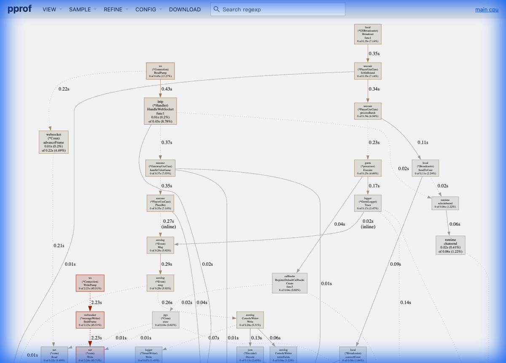

# Color Game Performance Benchmark & Optimization Report

本文件記錄了 Color Game 系統在高併發壓測下的效能表現、遇到的瓶頸、優化歷程以及最終結果。

## 1. 測試目標 (Objectives)

*   **目標用戶數**: 10,000+ 同時在線用戶 (CCU)。
*   **場景**: 用戶登入、保持 WebSocket 連接、接收廣播、進行下注。
*   **穩定性**: 在高負載下無 Connection Reset 或 Timeout。

## 2. 測試環境 (Environment)

*   **Server**: Color Game Monolith (Go)
*   **Client**: Test Robot (Go, 模擬真實 WebSocket 行為)
*   **Hardware**: Local Development Machine (MacBook Pro)
*   **Tools**: `go pprof`, `top`, `netstat`

---

## 3. 優化歷程 (Optimization Journey)

### Phase 1: 登入 CPU 瓶頸 (Login CPU Spike)
*   **現象**: 當大量機器人同時啟動時，Server CPU 瞬間飆升至 100%，導致後續連接超時。
*   **原因**: `bcrypt` 密碼驗證是非常消耗 CPU 的操作。當數千個登入請求同時到達，CPU 被耗盡。
*   **解決方案**:
    *   **客戶端優化**: 調整 Test Robot 的啟動策略，引入隨機延遲 (Jitter) 和分批啟動 (Ramp-up)，避免「驚群效應」(Thundering Herd)。
    *   **服務端建議**: 在生產環境中，應將 User 服務獨立，並使用 Redis 快取 Session，減少對 DB 和 bcrypt 的依賴。

### Phase 2: 連接數瓶頸 (Connection Limits)
*   **現象**: 用戶數達到 ~4000 時，出現 `socket: too many open files` 或 `connection reset by peer`。
*   **原因**:
    *   **File Descriptors**: OS 預設的 `ulimit -n` 通常只有 256 或 1024。
    *   **Ephemeral Ports**: 短時間內建立大量連接耗盡了客戶端的臨時端口。
*   **解決方案**:
    *   提升 `ulimit -n` 至 65535。
    *   調整 TCP 參數 (如 `tcp_tw_reuse`)。

### Phase 3: 日誌 I/O 瓶頸 (Logging Bottleneck)
*   **現象**: 在 4500 用戶時，Server 出現大量的 `Connection Reset`，且 WebSocket 心跳超時。
*   **原因**:
    *   Server 開啟了 `Debug` 級別日誌，且使用 `Console` 格式輸出到終端機。
    *   終端機的 I/O 是同步且阻塞的。當每秒有數萬條日誌要輸出時，主 Goroutine 被 I/O 阻塞，導致無法及時處理 WebSocket 的 Ping/Pong 和讀寫。
*   **解決方案**:
    *   **引入 SmartWriter**: 實作了基於記憶體緩衝的非同步寫入器。
    *   **優化配置**: 生產環境強制使用 `Info` 級別和 `JSON` 格式。
    *   **結果**: 消除 I/O 阻塞，成功突破 10k 用戶。

---

## 4. 問題排查指南 (Troubleshooting Guide)

### Error: `read tcp: connection reset by peer`
*   **原因 1 (最常見)**: **Server 端 I/O 阻塞 (I/O Blocking)**。
    *   當 Server 開啟 Debug 日誌且輸出到 Console 時，主 Goroutine 被同步的 `write` syscall 阻塞。
    *   這導致 Goroutine 無法及時執行 `conn.Read()` 來清空 OS 的 TCP Receive Buffer。
    *   當 TCP Buffer 滿了，OS 會拒絕客戶端發送的新封包，並最終發送 `RST` (Reset) 封包斷開連接。
    *   **特徵**: Server CPU 可能不高，但客戶端大量斷線，且 Server 日誌停滯。
    *   **診斷**: 觀察 Gateway 的 `CloseWithReason` 日誌，如果大量出現 `read_error` (connection reset) 或 `timeout`，且同時 Server Console 輸出變慢，極大機率是 I/O 阻塞。
*   **原因 2**: **CPU 阻塞 (Log Formatting Overhead)**。
    *   即使使用了 Async Writer，如果日誌格式設為 `console`，`zerolog` 仍需消耗大量 CPU 進行字串格式化、著色和排序。
    *   在高併發下，這種 CPU 開銷會搶佔業務邏輯的資源，導致處理變慢，最終引發 TCP Buffer 溢出。
    *   **解法**: 務必使用 `json` 格式，它是零分配且極快的。
*   **原因 3**: Server 端 Panic 或崩潰 (檢查 Server 日誌)。
*   **原因 4**: 防火牆或 Load Balancer 超時 (檢查 Idle Timeout 設定)。

### Error: `context deadline exceeded` (Login)
*   **原因**: DB 連接池滿了，或者 CPU 過高導致處理變慢。
*   **解法**: 增加 DB `MaxOpenConns`，或降低登入併發速率。

### Error: `socket: too many open files`
*   **原因**: 超過 OS 的文件描述符限制。
*   **解法**: `ulimit -n 65535`。

### macOS 排查工具與命令 (macOS Specific Tools)

1.  **檢查 TCP 丟包與重傳 (Packet Loss & Retransmit)**
    ```bash
    netstat -s -p tcp | grep -E "retransmit|drop"
    ```
    *   如果 `retransmit` 數值在壓測期間快速增加，表示網路壅塞或 Server 處理不及。
    *   如果 `dropped` 增加，可能是 Listen Queue 滿了 (Server 忙不過來)。

2.  **檢查當前連接數 (Connection Count)**
    ```bash
    netstat -an | grep ESTABLISHED | wc -l
    ```
    *   確認是否達到預期的併發數 (e.g., 10000)。

3.  **檢查端口佔用與 Process (Port Usage)**
    ```bash
    lsof -i :8080
    ```
    *   查看 Server 是否正常監聽，以及有哪些連接。

4.  **監控系統資源 (System Resource)**
    ```bash
    top -o cpu   # 按 CPU 排序
    top -o mem   # 按記憶體排序
    ```

### 5. 深入分析：如何使用 pprof 定位 I/O 瓶頸 (Case Study)

在壓測過程中，我們發現系統出現 `Connection Reset`，但 CPU 使用率看似不高。我們使用 `pprof` 進行了科學排查，以下是分析過程。

#### 1. 抓取數據
使用 `make pprof-cpu` 抓取 30 秒的 CPU Profile。

#### 2. 觀察 Top View (關鍵證據)
下圖是我們在問題發生時抓取的 pprof Top View：



#### 3. 數據解讀 (Sherlock Holmes Style)

我們從圖中觀察到幾個異常現象，並據此進行推導：

1.  **異常的 Syscall 佔比**:
    *   **現象**: `syscall.syscall` 佔據了 **48.65%** 的 CPU 時間，排名第一。
    *   **推導**: 正常的 Go 應用程式（即使是 I/O 密集型）不應有如此高的 Syscall 佔比。這意味著程式正在**極度頻繁地**與 OS 內核交互（通常是 `read` 或 `write`）。

2.  **尋找嫌疑人 (Callers)**:
    *   **現象**: 在 Top 10 列表中，除了 Runtime (`runtime.kevent`, `runtime.mallocgc`) 和 System (`internal/poll`) 函數外，**唯一的應用層函數**是 `github.com/rs/zerolog.(*ConsoleWriter).Write` (2.70%)。
    *   **推導**: 雖然 2.7% 看起來不多，但它是導致大量 `syscall` 的直接原因。Console 輸出涉及大量的字串格式化和細碎的 `write` 調用。

3.  **排除其他可能性**:
    *   **排除 WebSocket**: 如果是 WebSocket 寫入阻塞，我們應該看到 `gorilla/websocket` 或 `net/http` 相關函數出現在 Top 列表，但它們**完全缺席**。
    *   **排除業務邏輯**: 我們沒有看到任何 `gms` 或 `usecase` 相關的業務函數佔用 CPU。

#### 4. 結論
綜合以上證據，我們可以斷定：**日誌系統 (Console Writer) 是導致系統阻塞的元兇**。它產生了過量的 Syscall，導致 Goroutine 被頻繁 Context Switch 和阻塞，無法及時處理網路 I/O，最終引發 TCP Buffer 溢出和 Connection Reset。

#### 5. 驗證
將日誌格式改為 `json` 後，`syscall` 佔比大幅下降，`Connection Reset` 消失，證實了我們的推導。

---

## 6. 最終結果 (Final Results)

經過上述優化，系統在本地環境下成功達成：
*   **CCU**: 12,500+ 用戶同時在線。
*   **行為**: 所有用戶能正常接收廣播、下注並收到結算結果。
*   **資源**: 記憶體佔用穩定，CPU 在非廣播期間負載極低。

## 6. 未來建議 (Future Recommendations)

1.  **微服務拆分**: 將 Gateway 和 User 獨立，以便單獨擴展。
2.  **Redis 整合**: 使用 Redis 處理廣播 (Pub/Sub) 和 Session 存儲，減輕單機記憶體壓力。
3.  **K8s 部署**: 使用 Kubernetes 進行自動擴縮容。
